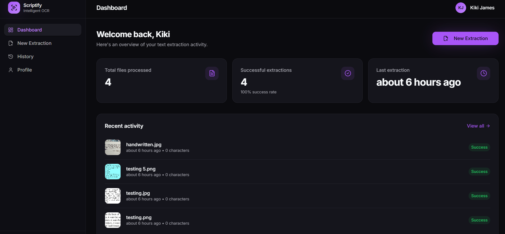
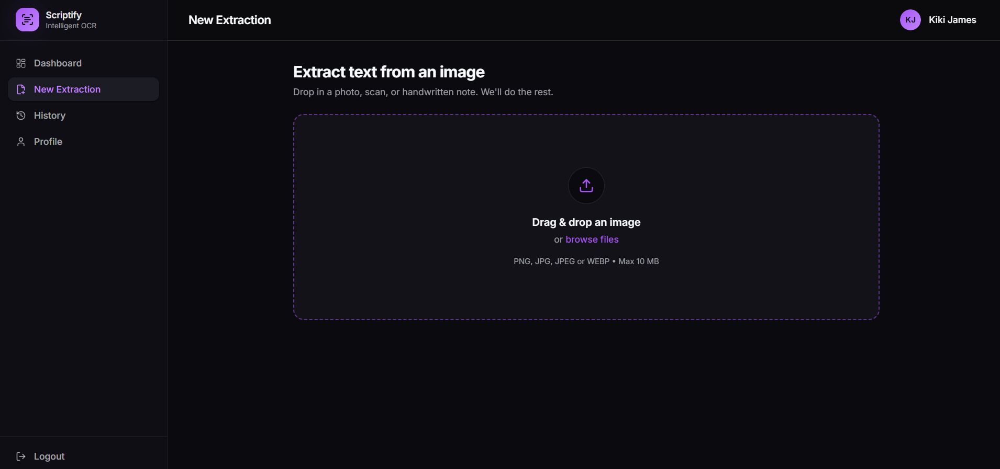
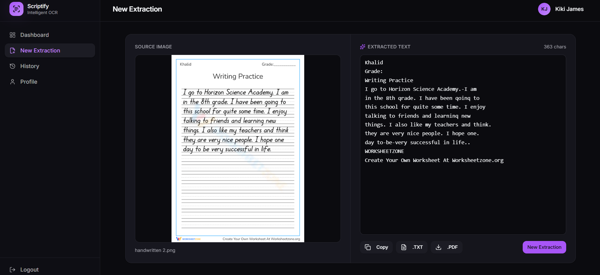
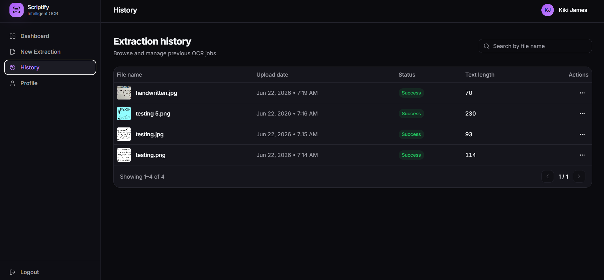

# Scriptify

**Scriptify** is a modern AI-powered OCR (Optical Character Recognition) web application that extracts text from images, including handwritten and printed content, with high accuracy.

The platform provides a secure authentication system, image upload functionality, OCR processing, extraction history management, and a modern dashboard experience for users.

---

## ✨ Features

### 🔐 Authentication
- User Registration
- User Login
- JWT-Based Authentication
- Secure Password Hashing (bcrypt)
- Guest Mode Support

### 📝 OCR Processing
- Drag & Drop Image Upload
- PNG, JPG, JPEG, WEBP Support
- AI-Powered Text Extraction
- Handwritten Text Recognition
- Automatic Text Cleanup
- Fast OCR Processing

### 📂 Extraction Management
- View OCR Results
- Download Extracted Text
- Extraction History
- Search Previous Extractions
- Delete Saved Extractions

### 👤 Profile Management
- View Profile Information
- Update User Details
- Change Password
- Logout Functionality

### 🎨 Modern User Experience
- Responsive Design
- Desktop, Tablet & Mobile Support
- Clean SaaS Dashboard
- Modern UI Components
- Smooth User Workflow

---

## 🛠️ Tech Stack

### Frontend
- React
- TypeScript
- Tailwind CSS
- shadcn/ui
- TanStack Router
- React Query
- Axios

### Backend
- FastAPI
- SQLAlchemy
- SQLite
- JWT Authentication
- Passlib (bcrypt)
- Pydantic
- Pillow

### OCR Engine
- PaddleOCR

---

## 📁 Project Structure

```text
scriptify/
│
├── frontend/
│   ├── src/
│   ├── public/
│   └── ...
│
├── backend/
│   ├── app/
│   │   ├── routes/
│   │   ├── services/
│   │   ├── schemas/
│   │   ├── database/
│   │   └── core/
│   │
│   ├── uploads/
│   └── ...
│
└── README.md
```

---

## 📸 Application Preview

### Dashboard



---

### New Extraction



---

### OCR Results



---

### Extraction History



---


## 🔄 OCR Workflow

```text
Upload Image
      │
      ▼
Validate File
      │
      ▼
PaddleOCR Processing
      │
      ▼
Text Cleanup
      │
      ▼
Display Results
      │
      ▼
Save to History (Authenticated Users)
```

---

## 🔒 Security Features

- JWT Authentication
- Password Hashing with bcrypt
- Protected Routes
- Secure API Access
- File Type Validation
- File Size Validation
- User-Specific Data Isolation

---

## 📈 Future Enhancements

- Multi-language OCR Support
- PDF OCR Extraction
- Batch Image Processing
- OCR Accuracy Analytics
- Cloud Storage Integration
- Export to DOCX
- OCR Model Selection
- Dark Mode Customization

---

## 👩‍💻 Author

**Shreya Nair**

B.Tech CSE (AIML)  
SRM Institute of Science and Technology

---

## 📄 License

This project is developed for educational, research, and portfolio purposes.